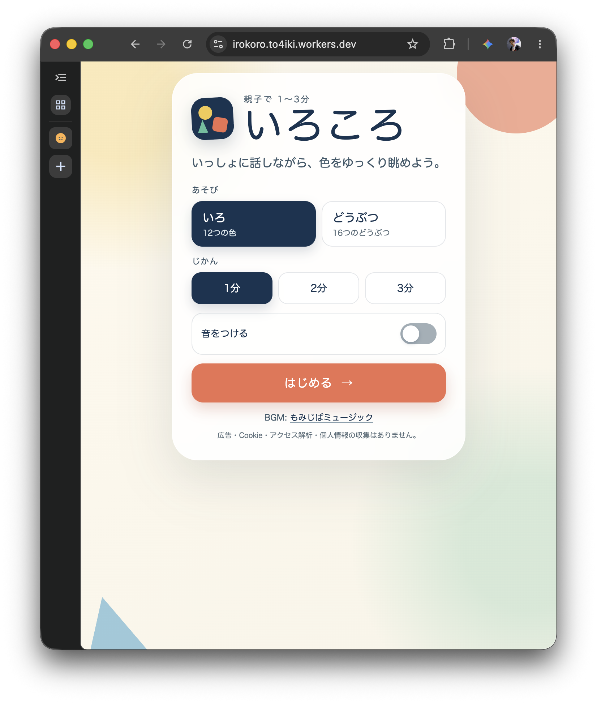
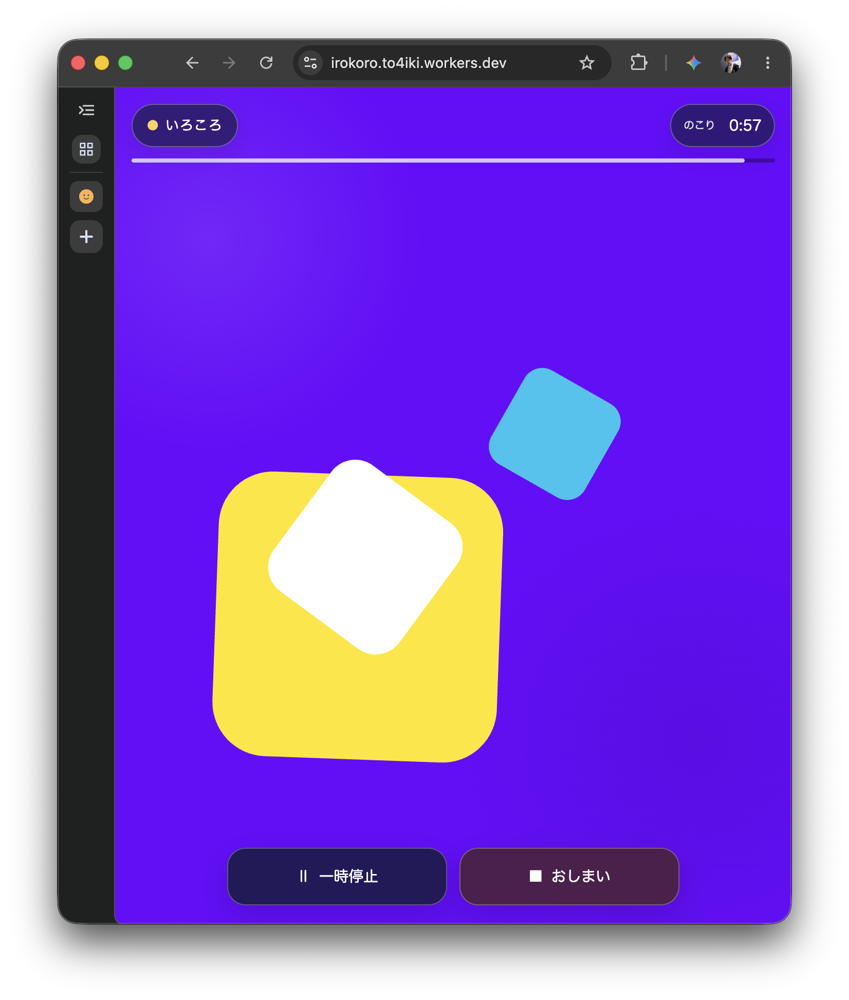
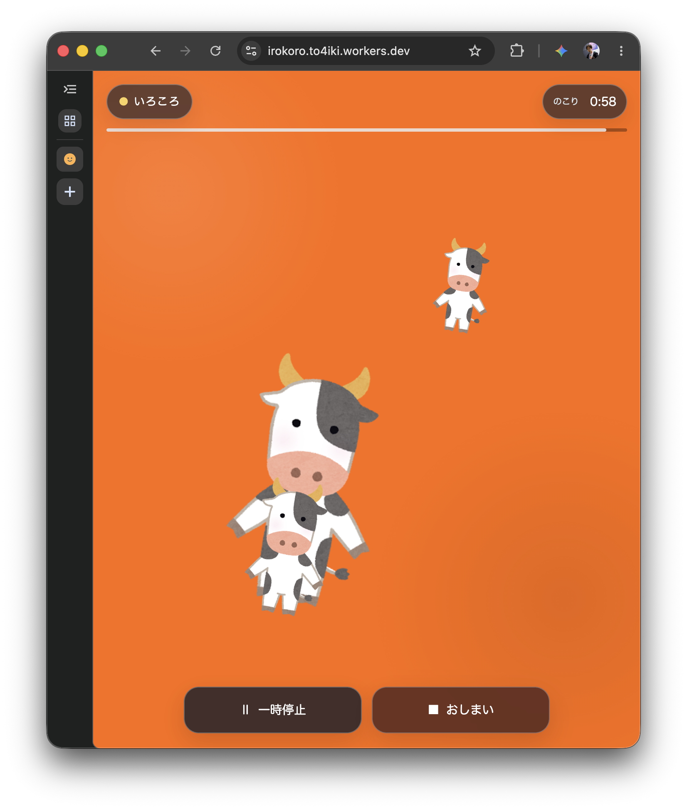

# いろころ

保護者が赤ちゃんに語りかけながら、色とかたちを1〜3分だけ楽しむための
小さな親子向けWebツールです。絵本や人との関わりの代替ではなく、画面の外の
遊びへつなぐ短時間の補助ツールとして設計しています。

## Screenshots

| セットアップ | いろ | どうぶつ |
| --- | --- | --- |
|  |  |  |

## セットアップ

```sh
mise trust
mise install
bun install --frozen-lockfile
apm install
bun run dev
```

## Agent Skills（APM）

```sh
apm update --yes
```
